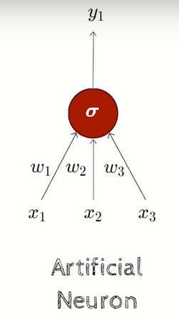
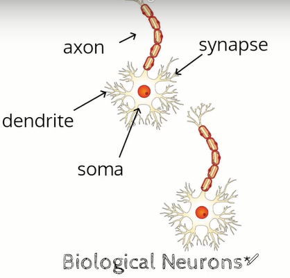
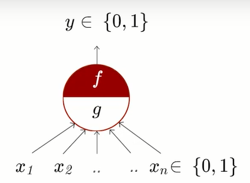
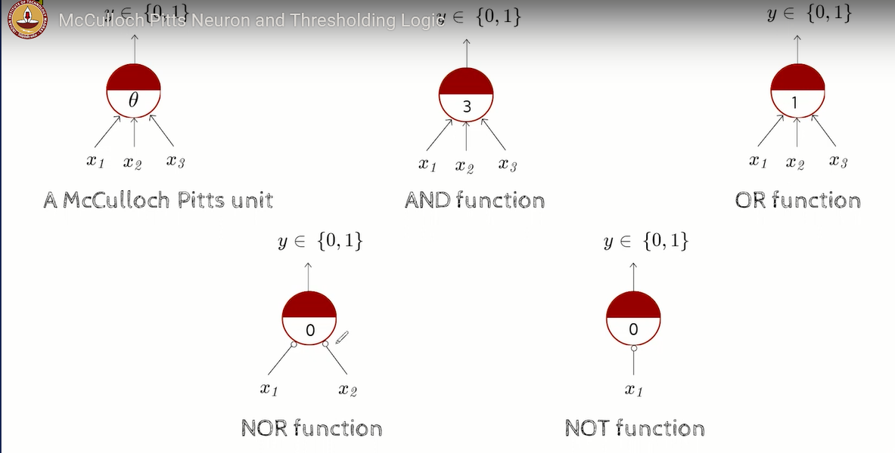
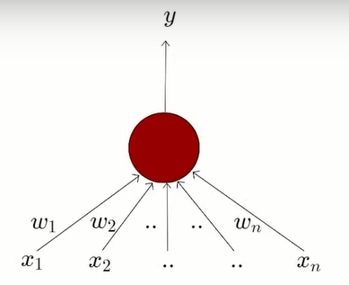

# Week 1

## [Lecture 1.6: Motivation from Biological Neuron](https://www.youtube.com/watch?v=KjMvUwq7PdQ)

- The most fundamental unit of a deep neural network is called an **artificial** *neuron*.
- The inspiration comes from biology (more specifically from the brain)
- **biological neurons = neuron cells = neural processing units**

### Biological Neuron

- **dendrite**: receives signals from other neurons
- **synapse**: point of connection to other neurons
- **soma**: process the information
- **axon**: transmits the output of the neuron

- Our sensory organs interact with the outside world and they relay information to the neurons. The neurons (may) get activated and produces a response
- Of course, in reality, its not just a single neuron that does all this but there is a massively parallel interconnected network of neurons.
- The sensory organs relay information to the lowest layer of neurons.
- An average human brain has around $10^{11}$ (100 billion) neurons
- This massively parallel network also ensures that there is division of work
- Each neuron may perform a certain role or respond to a certain stimulus.

## [Lecture 1.7: McCulloch Pitts Neuron and Thresholding Logic](https://www.youtube.com/watch?v=-bxOadOFNYc)

- McCulloch and Pitts proposed a highly simplified computational model of the neuron
- $g$ aggregates the inputs and the function $f$ takes a decision based on this aggregation
- The inputs can be excitatory and inhibitory ( if a particular input is "ON", no matter what the other inputs are, the output will always be zero.)
  - $y = 0$ if any $x_i$ is inhibitory, else
$$
\large
g(x_1, x_2,..., x_n) = g(x) = \sum_{i=1}^n x_i \\
y = f(g(x)) = 1 \quad \text{if} \quad g(x) \ge \theta
$$
- $\theta$ is called thresholding parameter

Here in NOT function $x_1$ is an inhibitory input.

## [Lecture 1.8: Perceptrons](https://www.youtube.com/watch?v=Ydd9TMyoG6k)

- Frank Rosenblatt, an American Psychologist proposed the classic perceptron model in 1958.
- A more general computationsal model than McCulloch-Pitts neurons
- **Main differences**: Introduction of numerical weights for inputs and a mechanism for learning these weights
- Inputs are no longer limited to boolean values
- Refined and carefully analyzed by Minsky and Papert (1969) - their model is referred to as the **perceptron** model here.

$$
\begin{align}
  y &= 1 \quad if  \quad \sum_{i=1}^n w_i*x_i \ge \theta \\
  &= 0 \quad if  \quad \sum_{i=1}^n w_i*x_i \lt \theta
\end{align}
$$
simplifying it and taking $w_0$ as $-\theta$ we get
$$
\begin{align}
  y &= 1 \quad if  \quad \sum_{i=0}^n w_i*x_i \ge 0 \\
  &= 0 \quad if  \quad \sum_{i=0}^n w_i*x_i \lt 0
\end{align}
$$

- From the equations it should be clear that even a perceptron separates the input space into two halves
- All the inputs which produce a 1 lie on one side and all inputs which produce a 0 lie on the other side
- In other words, a single perceptron can only be used to implement linearly seperable functions
- Then what is the difference between McCulloch-Pitts model and Perceptron?
  - The weights (including the threshold) can be learned and the inputs can be real valued.
