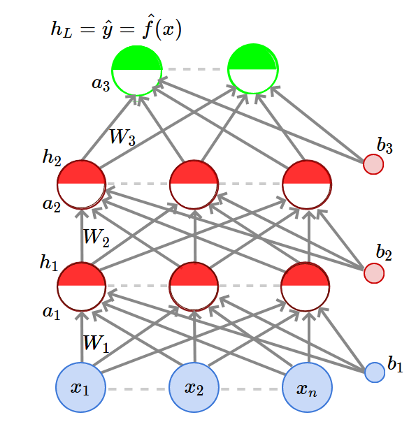

# [Lecture 3.1: Feed Forward Neural Network](https://www.youtube.com/watch?v=HHv6Ndo9VBU)

- The input to the network is an $n$-dimensional vector
- The network contains **$L - 1$** hidden layers (2 in this case) having **$n$** neurons each.
- Finally, there is one output layer containing **$k$** neurons (say corresponding to **$k$** classes).
- Each neuron in the hidden layer and the output layer can be split into two parts: pre-activation ($a_i$) and activation($h_i$). Both $a_i$ and $h_i$ are vectors.
- The input layer is called 0-th layer and the output layer is called the (**$L$**)-th layer.
- $\large W_i \isin \mathbb{R}^{n \times n}$ and $\large b_i \isin \mathbb{R}^n$ are the weight and the bias between the layers $i-1$ and $i$ ( $\large 0 \lt i \lt L$ ).
- $\large W_L \isin \mathbb{R}^{k \times n}$ and $\large b_L \isin \mathbb{R}^k$ are the weight and the bias between the last hidden layer and output layer (L = 3 in this case)
- The pre-activation at the layer $i$ is given by
$$
\large
a_i(x) = b_i(x) + W_ih_{i-1}(x)
$$
- The activation at the layer $i$ is given by
$$
\large
h_i(x) = g(a_i(x))
$$

where $g$ is called the activation function (for example logistic, tanh, linear etc)

- The activation at the output layer is given by
$$
\large
f(x) = h_L(x) = O(a_L(x))
$$

where $O$ is the output activation function (for example softmax, linear etc).

> To simplify notation we will refer to $a_i(x)$ as $a_i$ and $h_i(x)$ as $h_i$,

So in the above diagram,

- **Data**: $\large \{x_i, y_i\}_{i=1}^N$
- **Model**:

$$
\large
\hat{y_i} = \hat{f}(x_i) = O(W_3g(W_2g(W_1x + b_1)+b_2)+b_3)
$$

- **Parameters**:

$$
\large
\theta = W_1,.... ,W_L, b_1, b_2, ... , b_L \quad (L=3) 
$$

- **Algorithm**: Gradient descent with back-propagation
- **Obejective/Loss/Error Function**: Say,

$$
min \frac{1}{N} \sum_{i=1}^N \sum_{j=1}^k (\hat{y}_{ij} - y_{ij})^2 \\
In \enspace general,\enspace min \enspace \mathscr{L}(\theta)
$$

where $\mathscr{L}(\theta)$ is some function of parameters.
