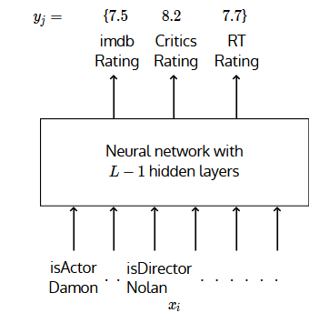
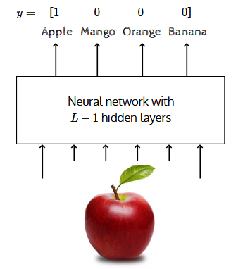
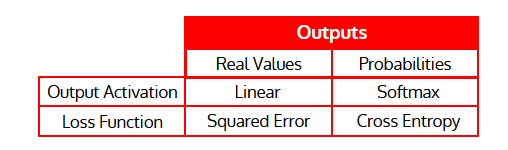

# [Lecture 3.3: Output functions and loss functions](https://www.youtube.com/watch?v=1hefEWZHvJg)

- The choice of loss function depends on problem at hand
- Consider movie example again but this time we are interested in predicting ratings

- Here $y_i \in \mathbb{R}^3$
- The loss function should capture how much $\hat{y}_j$ deviates from $y_j$
- If $y_j \in \mathbb{R}^3$ then the squared error loss can capture this deviation

$$
\mathscr{L}(\theta) = \frac{1}{N} \sigma_{i=1}^N \sigma_{j=1}^k (\hat{y}_{ij} - y_{ij})^2
$$

- A related question would be what is the output functions 'O' be if $y_j \in \mathbb{R}$
- More specifically, can it be the logistic function?
- No because it restricts $\hat{y}_j$ to the value to between 0 and 1. But we want $y_j \in \mathbb{R}$
- So, in such cases it makes sense to have 'O' as linear function

$$
\begin{align}
    \hat{f}(x) &= h_L = O(a_L) \\
    &= W_O a_L + b_O
\end{align}
$$

- $\hat{y}_j = \hat{f}(X_i)$ is no longer bounded between 0 and 1

- Now let us consider another problem for which a different loss function would be appropriate.
- Suppose we want to classify an image into 1 of the $k$ classes
- Here again we could use the squared error loss to capture the deviation
- Notice that $y$ is a probability distribution
- Therefore we should also ensure that $\hat{y}$ is a probability distribution
- We use **softmax** function to get the expected output in a probability distribution
  - $a_L = W_L h_{L-1} + b_L$
  - $\large y_i = O(a_L)_j = \frac{e^{L,j}}{\sum_{i=1}^k e^{a_{L,j}}}$
- $O(a_L)_j$ is the $j^{th}$ element of $\hat{y}$ and $a_{L,j}$ is the $j^{th}$ element of the vector $a_L$.
- **Cross Entropy**:
$$\mathscr{L}(\theta) = -\sum_{c=1}^k y_c \log \hat{y}_c$$

Notice that

- $y_c = 1$ if $c = l$ ( the true class label) and 0 otherwise.

$$
\because \enspace \mathscr{L}(\theta) = - \log \hat{y}_l
$$

- So for classification problem (where we have to choose 1 of K classes), we use the following objective function
  - $\text{minimize} \enspace \mathscr{L}(\theta) = - \log \hat{y}_l$
  - $y_l$ is a function of $\theta$ and is the probablity that $x$ belongs to $l$ class.
  - $\log y_l$ is called **log-likelihood** of the data.

